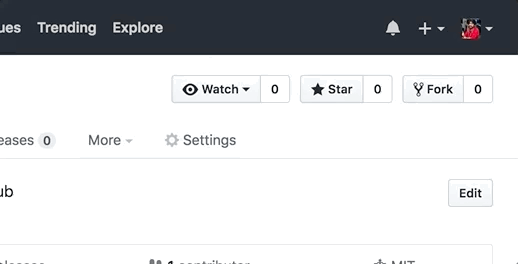
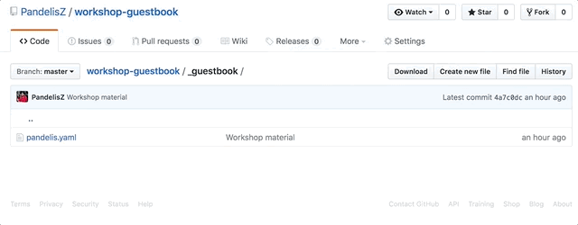
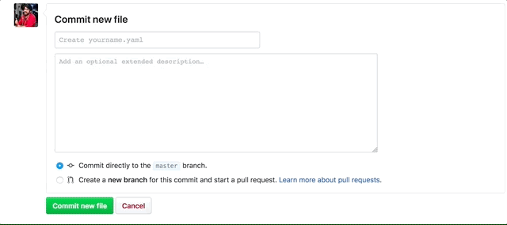

# Workshop Guestbook 📓

Hey welcome to this workshops guestbook! By signing this guestbook we will explore many of the core concepts of GitHub. 
By the end of this workshop you will have forked a repo, created a commit, made a pull request and signed your name on the guestbook.

# Signing the guestbook

## Using GitHub.com

### Forks

GitHub let's you adapt any piblic repository using forks. Forks copy the entire repository to your profile so that you have ownership and 
controll. This let's you add features to a project without needing to request direct access to a repository.

Let's fork this repository to get started:



### Making a change

The repository will now exist as a seperate repository under your GitHub profile. From your fork go to the `/_guestbook` folder and click on **Create new file**. 
Name this file **yourname.yaml**. Then paste the bellow template into your file and replace it with your details. You can delete any fields you dont want to fill except *name* and *image*

```
---
name: Dan
image: https://avatar.tobi.sh/tobiaslins.svg?text=DS
emoji: 🦔
message: Hey! I hope you're enjoying the workshop.
twitter: sdaniel55
github: sdaniel55
---
```



> If you don't wish to use a photo of yourself leve the placeholder image and add your initials as `?text=DS` for example.

> You can find your favorite emoji at [emojipedia.org](https://emojipedia.org/) and paste it into the emoji field

### Commiting

At the bottom of the new file page you'll be able to submit this change as a **commit**. Scroll to the bottom of the page and enter the commit details. 
Commit messages should be short and descriptive so that others can tell what you're changing or adding.




### Submitting a pull request

Now that you have made your desired changes to the repo you can submit them **upstream** (the original repository). The way we do this within the [GitHub flow](https://guides.github.com/introduction/flow/) is by creating a pull request on the upstream repository. In this case the upstream repository is the original repository you 
forked. This is shown on your repo as **forked from:** at the top of the repository page.

To submit a pull request navigate to the original upstream repository and go to the **Pull requests** tab and click **New pull request**. If GitHub does not automatically detect
your fork you can click on *compare across forks*. Then create the pull reqeust


### Congrats :tada:

You've sucessfully creted a pull request! You're changes will now have to be reviewed. If you're filled out your details correctly your pull request will be approved and you will show up on the 
guestbook.


### Credits :sparkling_heart:

Thanks to [@PandelisZ](https://github.com/PandelisZ) for making this guestbook